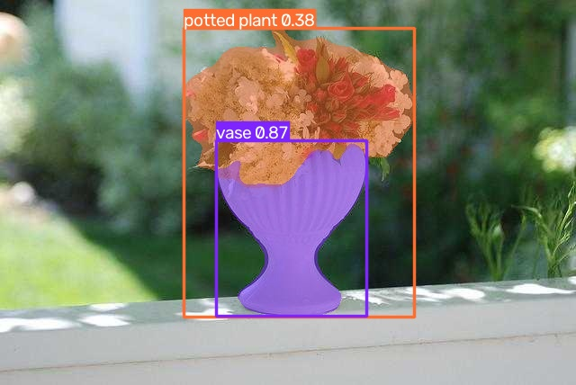

# LaneVision-V1：基于 YOLOv8-seg 的 CPU 端实时感知系统

<p align="center">
  
</p>

<p align="center">
  <a href="#-项目简介">项目简介</a> •
  <a href="#-技术栈">技术栈</a> •
  <a href="#-快速开始">快速开始</a> •
  <a href="#-性能表现">性能表现</a> •
  <a href="#-效果展示">效果展示</a>
</p>

---

## 📌 项目简介

**LaneVision-V1** 是一套面向自动驾驶感知场景的**轻量级目标检测与实例分割**系统。

本项目模拟了**边缘端（CPU）算力受限**的真实工业场景，通过模型轻量化与输入分辨率适配，成功在普通办公电脑上实现了 **20 FPS** 的实时推理，并完成了**从数据理解 → 模型推理 → 视频流落地**的完整工程闭环。

### 🎯 核心功能（按开发流程排序）
1. ✅ **数据可视化**：解析数据集标注文件，将多边形分割点还原至原图，验证数据管线的正确性
2. ✅ **单图推理**：加载预训练模型，对单张图片输出检测框与分割蒙版
3. ✅ **视频流处理**：支持本地视频 / 摄像头实时流，推理结果同步保存为 MP4 文件

---

## 🧠 技术栈

| 工具 | 用途 |
| :--- | :--- |
| **Python 3.10** | 开发语言 |
| **PyTorch** | 深度学习框架 |
| **YOLOv8-seg (Nano)** | 目标检测 + 实例分割模型 |
| **OpenCV** | 图像处理与视频流读写 |
| **Ultralytics** | YOLO 模型部署工具链 |
| **NumPy / Matplotlib** | 数据处理与可视化辅助 |

---

## 🚀 快速开始（按推荐执行顺序）

### 1️⃣ 克隆仓库

```bash
git clone https://github.com/Bubble357/LaneVision-V1.git
cd LaneVision-V1
```

### 2️⃣ 安装依赖

```bash
pip install -r requirements.txt
```

> ⚠️ 首次运行 `infer.py` 时会自动下载预训练权重 `yolov8n-seg.pt`（约 **7 MB**），请保持网络畅通。

### 3️⃣ 按顺序运行

| 步骤 | 命令 | 说明 |
| :---: | :--- | :--- |
| ① | `python visualize.py` | **数据可视化**：查看数据集标注的真值（绿色多边形轮廓） |
| ② | `python infer.py` | **单图推理**：对单张图片输出检测框 + 分割蒙版 |
| ③ | `python video_infer.py` | **实时预览**：视频/摄像头推理（按 `q` 或 `ESC` 退出） |
| ④ | `python video_save.py` | **保存结果**：视频推理并自动保存为 `output_video.mp4` |

> 💡 建议先运行 `visualize.py` 查看数据标注，再运行推理脚本对比模型预测效果。

---

## 📊 性能表现

| 硬件环境 | 输入尺寸 | 推理帧率 |
| :--- | :--- | :--- |
| Intel Core i5（无独立显卡） | 320 × 320 | **~20 FPS** |
| Intel Core i5（无独立显卡） | 640 × 640 | **~8 FPS** |

> 💡 通过降低输入分辨率（640→320），在 CPU 环境下实现了 **2.5 倍** 的推理速度提升。

---

## 📷 效果展示

| ① Ground Truth（数据标注真值） | ② YOLOv8-seg 预测结果 |
| :---: | :---: |
|  |  |
| 运行 `visualize.py` 得到：数据集提供的多边形分割标注（绿色轮廓线） | 运行 `infer.py` 得到：模型输出的检测框 + 彩色分割蒙版 |

---

## 📂 项目结构

```
LaneVision-V1/
├── visualize.py             # ① 数据可视化：绘制数据集标注的真值
├── infer.py                 # ② 单张图片推理：输出检测框 + 分割蒙版
├── video_infer.py           # ③ 视频/摄像头实时预览
├── video_save.py            # ④ 视频推理并保存为 MP4
├── requirements.txt         # Python 依赖清单
├── .gitignore               # Git 忽略规则
├── sample_ground_truth.jpg  # 真值示例图（visualize.py 输出）
├── sample_yolo_prediction.jpg # 模型预测示例图（infer.py 输出）
└── README.md                # 项目说明文档
```

> 📌 建议按编号顺序阅读和运行，从数据理解开始逐步推进到模型部署。

---

## 💡 优化策略（工程亮点）

1. **模型轻量化**：选用 YOLOv8-seg Nano 版本，参数量仅 **3.2M**，适合边缘端部署。
2. **分辨率适配**：将输入尺寸从默认的 640×640 压缩至 320×320，计算量减少至 **1/4**。
3. **跳帧推理**：在视频流处理中支持跳帧策略，进一步平衡 CPU 负载与画面流畅度。
4. **代码与数据分离**：遵循工程规范，权重文件与数据集不纳入版本控制，通过脚本自动下载。

## 📄 License

本项目仅供学习与展示使用。
